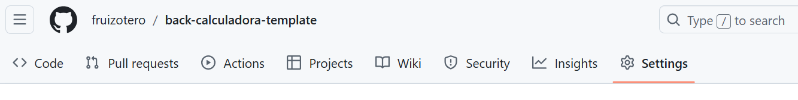
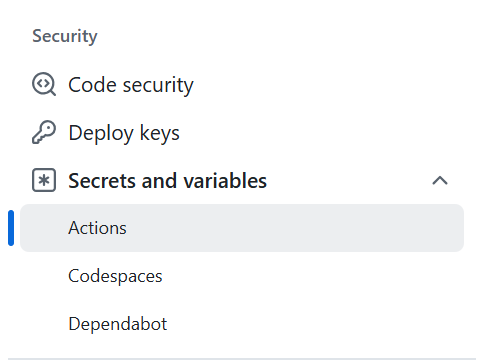
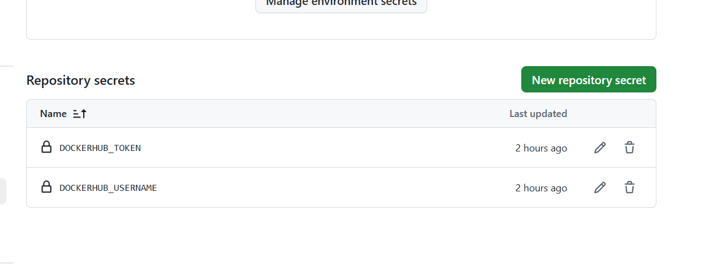
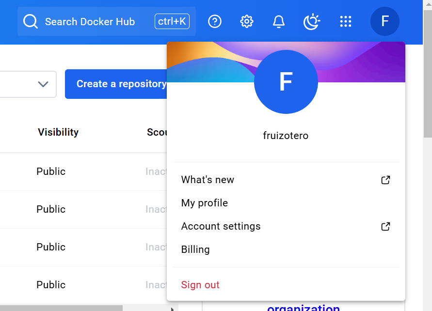
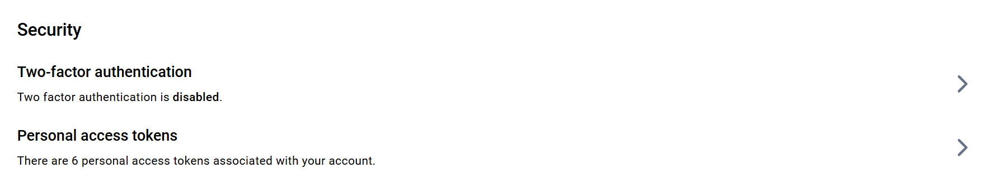
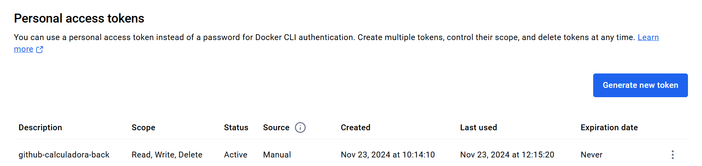

# Back Calculadora - GitHub Actions

Este repositorio contiene el backend de una calculadora y las configuraciones necesarias para su despliegue utilizando **GitHub Actions** y **Docker**.

---

## Entorno Local en Windows (Bash)

### Crear y Activar el Entorno Virtual
1. Crear el entorno virtual:
   ```bash
   python -m venv .venv
   ```
2. Activar el entorno:
   ```bash
   source .venv/Scripts/activate
   ```

### Instalar Requerimientos
Ejecuta el siguiente comando para instalar las dependencias:
```bash
pip install -r requirements.txt
```

---

## Ejecutar la Aplicación

Para iniciar la aplicación, utiliza el siguiente comando:
```bash
fastapi dev main.py --port 8000
```

---

## Solución a Problemas de Importación

Si encuentras problemas para importar módulos, añade las siguientes líneas al inicio de los scripts afectados:
```python
import sys
import os
sys.path.append(os.path.abspath(os.path.join(os.path.dirname(__file__), '..')))
```

---

## Pruebas

### Ejecutar Tests
Desde la raíz del proyecto, ejecuta las pruebas utilizando:
```bash
pytest
```

### Requerimientos para la API
Asegúrate de que la librería `fastapi[standard]` está instalada para un entorno completo de FastAPI:
```bash
pip install fastapi[standard]
```

---

## Docker

### Crear una Imagen
Asegúrate de haber configurado correctamente el archivo `Dockerfile`. Luego, ejecuta:
```bash
docker build --no-cache -t back-calculadora-daw .
```

### Crear un Contenedor
Usa el nombre o hash de la imagen para crear un contenedor. Lista las imágenes disponibles con:
```bash
docker images
```

Luego, ejecuta:
```bash
docker run -d -p 8000:8000 back-calculadora-daw
```

---

## Configuración para GitHub Actions

Para obtener el código del repositorio, generar una imagen Docker y subirla a Docker Hub, se utilizan las siguientes acciones del Marketplace de GitHub:

1. [Checkout Action](https://github.com/marketplace/actions/checkout)  
   No requiere configuración adicional.

2. [Build and Push Docker Images](https://github.com/marketplace/actions/build-and-push-docker-images)  
   Necesita configuración de usuario y token.

---

### Configuración del Token de Docker Hub

#### 1. Crear Variables de Entorno en GitHub
1. Ve al repositorio y haz clic en **Settings**.
   
2. En el menú lateral, selecciona **Security → Secrets and variables → Actions**.
   
3. Añade las variables necesarias para autenticarte:
   - **DOCKERHUB_USERNAME**: Tu nombre de usuario en Docker Hub.
   - **DOCKERHUB_TOKEN**: Un token generado en Docker Hub.  
   

#### 2. Obtener el Token de Docker Hub
1. Accede a tu perfil en Docker Hub y ve a **Account Settings → Security → Personal Access Tokens**.
2. Genera un nuevo token, cópialo y guárdalo como valor de la variable **DOCKERHUB_TOKEN** en GitHub.
     
     
   

Con estas configuraciones, tu flujo de trabajo en GitHub Actions estará listo para construir y gestionar imágenes Docker automáticamente.
